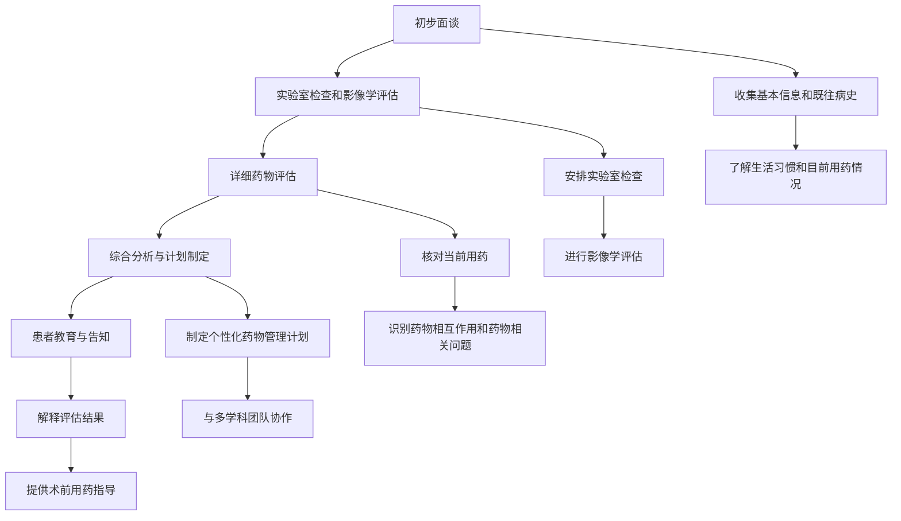

```mermaid
graph TD
  A[初步面谈] --> B[实验室检查和影像学评估]
  B --> C[详细药物评估]
  C --> D[综合分析与计划制定]
  D --> E[患者教育与告知]
  
  A --> A1[收集基本信息和既往病史]
  A1 --> A2[了解生活习惯和目前用药情况]
  
  B --> B1[安排实验室检查]
  B1 --> B2[进行影像学评估]
  
  C --> C1[核对当前用药]
  C1 --> C2[识别药物相互作用和药物相关问题]
  
  D --> D1[制定个性化药物管理计划]
  D1 --> D2[与多学科团队协作]

  E --> E1[解释评估结果]
  E1 --> E2[提供术前用药指导]

            
```