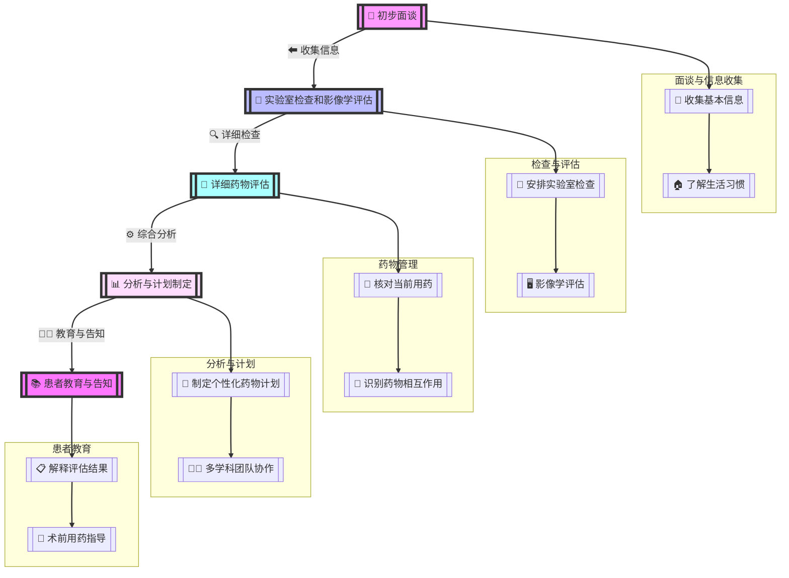

```mermaid
flowchart TD
  A[[🎤 初步面谈]] -->|⬅ 收集信息| B[[📝 实验室检查和影像学评估]]
  B -->|🔍 详细检查| C[[💊 详细药物评估]]
  C -->|⚙ 综合分析| D[[📊 分析与计划制定]]
  D -->|🧑‍🏫 教育与告知| E[[📚 患者教育与告知]]
  
  subgraph 面谈与信息收集
    A1[[📄 收集基本信息]]
    A2[[🏠 了解生活习惯]]
  end
  A --> A1
  A1 --> A2
  
  subgraph 检查与评估
    B1[[💉 安排实验室检查]]
    B2[[🖥 影像学评估]]
  end
  B --> B1
  B1 --> B2
  
  subgraph 药物管理
    C1[[💊 核对当前用药]]
    C2[[🔬 识别药物相互作用]]
  end
  C --> C1
  C1 --> C2
  
  subgraph 分析与计划
    D1[[📝 制定个性化药物计划]]
    D2[[👨‍⚕️ 多学科团队协作]]
  end
  D --> D1
  D1 --> D2
  
  subgraph 患者教育
    E1[[📋 解释评估结果]]
    E2[[🧾 术前用药指导]]
  end
  E --> E1
  E1 --> E2

  style A fill:#f9f,stroke:#333,stroke-width:4px
  style B fill:#bbf,stroke:#333,stroke-width:4px
  style C fill:#aff,stroke:#333,stroke-width:4px
  style D fill:#fdf,stroke:#333,stroke-width:4px
  style E fill:#f7f,stroke:#333,stroke-width:4px
  linkStyle default stroke:#333,stroke-width:2px

```