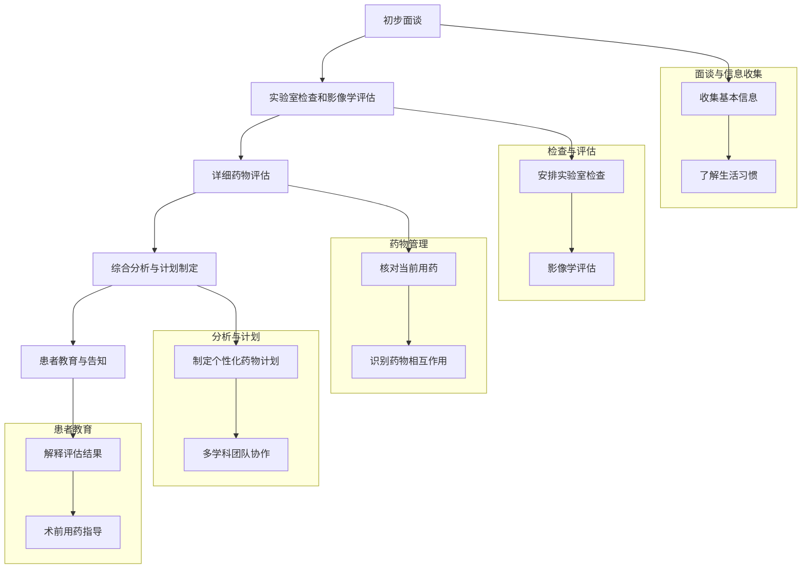

```mermaid
flowchart TD
  A[初步面谈] --> B[实验室检查和影像学评估]
  B --> C[详细药物评估]
  C --> D[综合分析与计划制定]
  D --> E[患者教育与告知]
  
  subgraph 面谈与信息收集
    A1[收集基本信息]
    A2[了解生活习惯]
  end
  A --> A1
  A1 --> A2
  
  subgraph 检查与评估
    B1[安排实验室检查]
    B2[影像学评估]
  end
  B --> B1
  B1 --> B2
  
  subgraph 药物管理
    C1[核对当前用药]
    C2[识别药物相互作用]
  end
  C --> C1
  C1 --> C2
  
  subgraph 分析与计划
    D1[制定个性化药物计划]
    D2[多学科团队协作]
  end
  D --> D1
  D1 --> D2
  
  subgraph 患者教育
    E1[解释评估结果]
    E2[术前用药指导]
  end
  E --> E1
  E1 --> E2

```